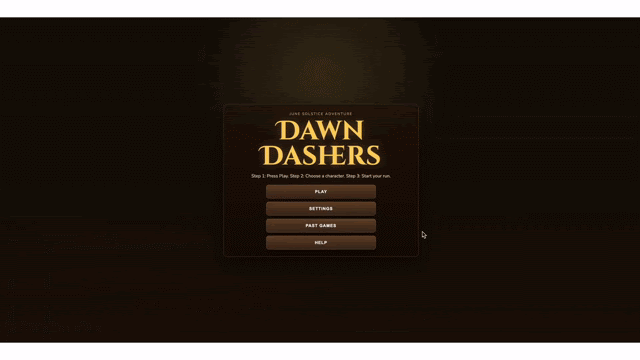

# Dawn Dashers

Browser-first runner + puzzle adventure inspired by the June Solstice.

## Current Stack

- Runtime: JavaScript in [web/game.js](web/game.js)
- Rendering: Three.js + Canvas/HUD layers
- Puzzle content: [web/puzzles](web/puzzles)
- Puzzle orchestration and seen persistence: [web/puzzle-data.js](web/puzzle-data.js)
- Puzzle tracking/filter helpers: [web/puzzle-tracker.js](web/puzzle-tracker.js), [web/puzzle-filter.js](web/puzzle-filter.js)
- Local dev hosting: Docker + Nginx via [docker-compose.yml](docker-compose.yml)

## Removed Legacy Components

- Unity project folders (`Assets`, `Packages`, `ProjectSettings`)
- Backend API service (runtime no longer calls API endpoints)

## Puzzle Model

Each level file provides three role-specific pools:

- `heartPuzzles`: 8 (IDs like `L1_HP01`)
- `levelPuzzles`: 8 (IDs like `L1_LP01`)
- `treasurePuzzles`: 7 (IDs like `L1_TP01`)

Every puzzle includes `seen`. Seen IDs persist in browser localStorage. When all puzzles in a pool are seen, that pool auto-resets to unseen and continues cycling.

## Local Development

1. Run: `docker compose up --build`
2. Open: `http://localhost:8080`

Current compose service:

- `web` only (Nginx static host)

## Controls

- Move lanes: `A/D` or `Left/Right`
- Jump: `W`, `Up`, or `Space`
- Slide: `S` or `Down`
- Pause/Resume: `P` or `Escape`

## Notes

- Visual effects degrade gracefully if advanced rendering features are unavailable.
- Audio starts after first user interaction to satisfy autoplay policies.
- [deploy/android/README.md](deploy/android/README.md) and [deploy/ios/README.md](deploy/ios/README.md) are legacy placeholders only.
